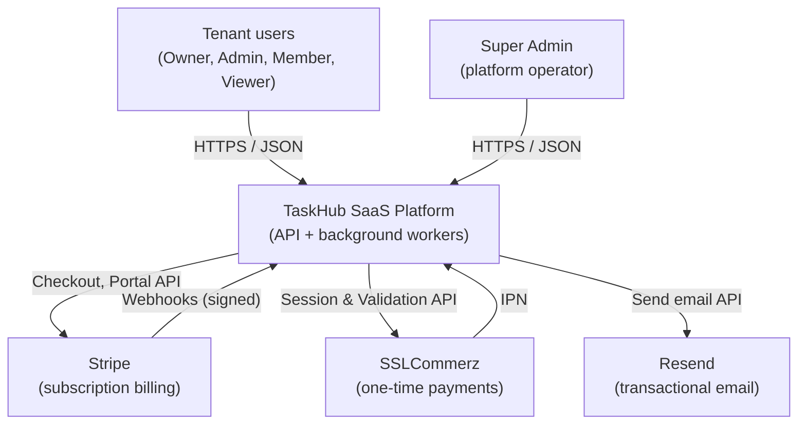
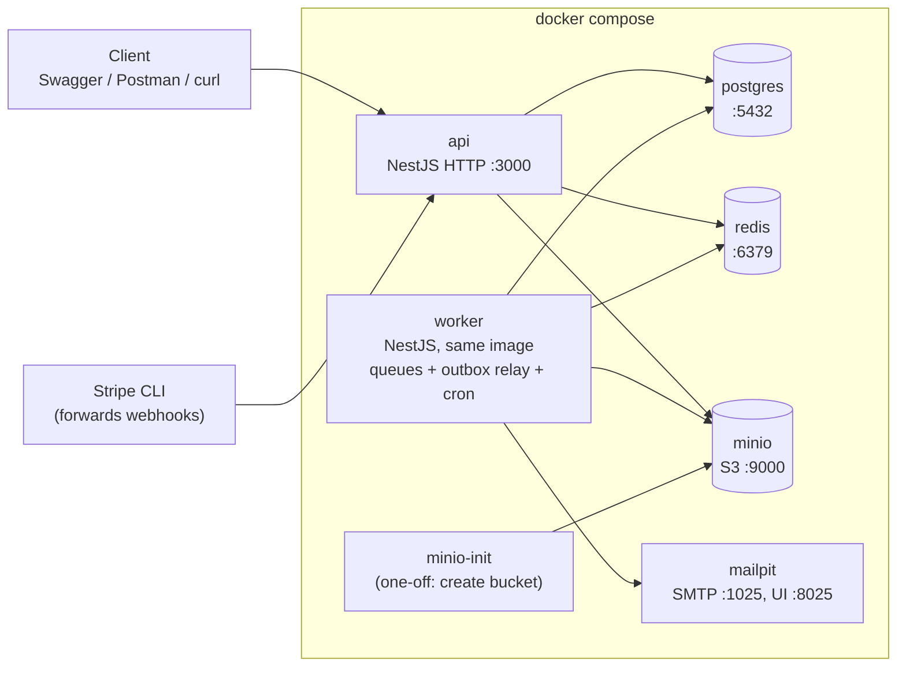
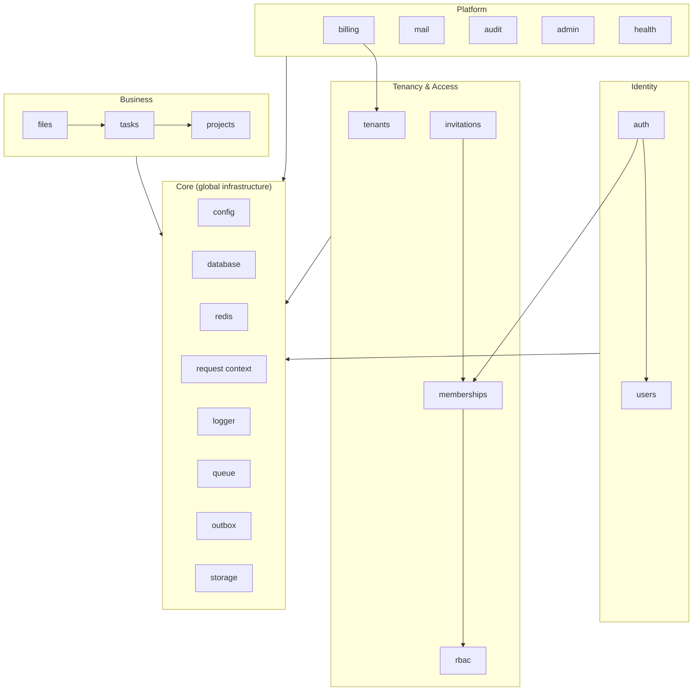
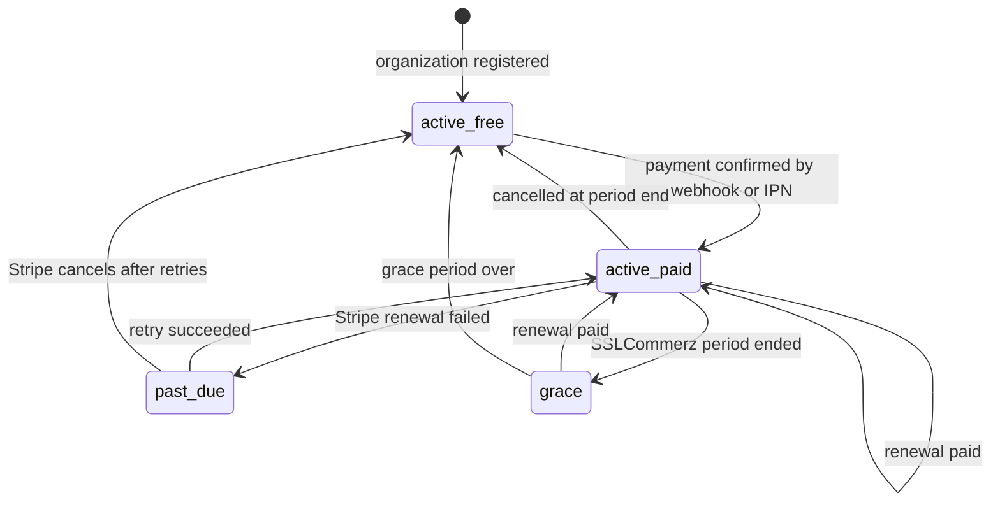

# Architecture — TaskHub

| Field | Value |
|---|---|
| Status | Draft v1.0 |
| Last updated | 2026-09-28 |
| Related | [PRD](01-PRD.md) · [System Flows](03-system-flows.md) · [Data Model](04-data-model.md) · [API Standards](05-api-standards.md) · [ADRs](adr/README.md) |

This document follows a lightweight **C4 model** (Context → Containers → Components) plus cross-cutting concerns. Every major decision links to an ADR explaining *why*.

---

## 1. Architectural drivers

The architecture exists to satisfy these quality attributes (from the [PRD §9](01-PRD.md#9-non-functional-requirements)). Each driver maps to concrete tactics.

| Driver | Tactics used |
|---|---|
| **Tenant isolation** (NFR-01) | `tenant_id` on every tenant row · active tenant inside the signed JWT · central tenant scoping in repositories · 404 on foreign resources · isolation tests · optional Postgres RLS |
| **Security** (NFR-02) | Deny-by-default guards · argon2id · short-lived JWT + rotating refresh tokens · rate limiting · webhook signature checks · private bucket + presigned URLs |
| **Reliability** (NFR-04) | Transactional outbox · durable BullMQ queues · retries with exponential backoff · idempotent consumers · webhook idempotency table |
| **Performance** (NFR-03) | Async for slow work · Redis cache-aside · keyset (cursor) pagination · tenant-leading composite indexes · direct-to-storage uploads |
| **Scalability** (NFR-05) | Stateless API · all shared state in Postgres/Redis · API and worker scale independently |
| **Maintainability** (NFR-08) | Modular monolith · layered modules · ports & adapters for vendors · enforced dependency rules |
| **Portability** (NFR-07) | 12-factor config · one image, many processes · compose with healthchecks · auto migrate + seed |

## 2. Architectural style

**Modular monolith** — one codebase, one Docker image, **two runtime processes** (`api` and `worker`), with strict internal module boundaries so any module could be extracted into a service later. → [ADR-0001](adr/0001-modular-monolith.md)

## 3. System context (C4 level 1)



## 4. Containers (C4 level 2)



| Container | Image | Responsibility | Persistence | Healthcheck |
|---|---|---|---|---|
| `api` | Project Dockerfile | HTTP API. Runs migrations + seeds on start (dev). | none (stateless) | `GET /health/ready` |
| `worker` | **Same image**, command `node dist/worker.js` | BullMQ consumers, outbox relay, scheduled jobs. | none (stateless) | process + Redis ping |
| `postgres` | `postgres:18-alpine` | System of record. | named volume `pg_data` | `pg_isready` |
| `redis` | `redis:8-alpine` | Queues, cache, sessions, rate limits, permission cache. AOF enabled. | named volume `redis_data` | `redis-cli ping` |
| `minio` | `minio/minio:<pinned tag>` | S3-compatible object storage. | named volume `minio_data` | `/minio/health/live` |
| `minio-init` | `minio/mc` | Creates the bucket and sets it private, then exits. | – | – (runs to completion) |
| `mailpit` | `axllent/mailpit` | Local SMTP server + web inbox for development. | – | built-in |

Notes:
- **Postgres 18 image:** the data directory layout changed in the 18+ images (volume mounted at `/var/lib/postgresql`). Check the image docs when defining the volume.
- **MinIO:** the community edition no longer publishes new official prebuilt images and its console was reduced. Pin an exact release tag and operate it with `mc`. Storage is used only through the `StorageProvider` port, so it can be swapped for another S3-compatible server.
- **Ports:** in development, database, Redis and MinIO ports are published to the host so CLI tools can connect. In production only the API would be exposed.
- **Networks:** `backend` (all services) and `edge` (only `api`). This mirrors a production layout where data stores are unreachable from outside.

## 5. Components (C4 level 3)

### 5.1 Module map



### 5.2 Module responsibilities

| Module | Owns (tables / keys) | Responsibility |
|---|---|---|
| `auth` | Redis `refresh:*`, `user_sessions:*`, `pwreset:*` | Register, login, refresh rotation, logout, password reset, switch tenant, JWT strategy |
| `users` | `users` | Profile, password change, lookup |
| `tenants` | `tenants` | Organization CRUD, slug, status, usage counters |
| `memberships` | `memberships` | User ↔ tenant ↔ role links, membership cache |
| `invitations` | `invitations` | Invite lifecycle |
| `rbac` | `roles`, `permissions`, `role_permissions`, Redis `perm:*` | Role management, permission resolution and caching |
| `projects` | `projects` | Project CRUD, archive, limit checks |
| `tasks` | `tasks` | Task CRUD, filters, assignment |
| `files` | `files` | Upload intents, confirmation, download URLs, deletion, thumbnails |
| `billing` | `plans`, `subscriptions`, `payments`, `webhook_events` | Plans, limits, checkout, webhooks, IPN, renewals |
| `mail` | – | Email templates, `MailProvider` port, email job consumer |
| `audit` | `audit_logs` | Records and queries audit events |
| `admin` | – | Super-admin endpoints (reads other modules through their public services) |
| `health` | – | Liveness / readiness |
| `outbox` | `outbox_events` | Writing events in transactions; relay to BullMQ |

### 5.3 Layering inside a module

Pragmatic **Clean / Hexagonal architecture**. Full layering for modules with real business rules (`auth`, `billing`, `files`, `rbac`); CRUD modules may merge domain into application.

```
modules/<name>/
├── presentation/      Controllers, request/response DTOs, Swagger decorators   → HTTP only
├── application/       Services = use cases; transaction boundaries; emits events
├── domain/            Entities' business rules, value objects, state machines, domain errors
└── infrastructure/    TypeORM repositories, external adapters (Stripe, MinIO, Resend)
```

**Dependency rule:** `presentation → application → domain ← infrastructure`. The domain never imports NestJS HTTP, TypeORM query builders, or vendor SDKs.

### 5.4 Module boundary rules

1. A module exposes **one public service** via its `exports`. Other modules never inject its repositories or entities' repositories.
2. **Cross-module side effects go through events** (outbox or in-process event emitter), not direct calls. Example: billing emits `subscription.downgraded`; nothing in billing knows about projects.
3. **No circular module imports.** Needing `forwardRef` is treated as a design smell that signals a wrong boundary.
4. `core` modules never import business modules.

### 5.5 Source layout

```
src/
├── main.ts                    # HTTP entry point
├── worker.ts                  # worker entry point (no HTTP server)
├── app.module.ts / worker.module.ts
├── core/
│   ├── config/                # env schema + typed config
│   ├── database/              # data-source.ts, migrations/, seeds/, base repository
│   ├── redis/  queue/  outbox/  storage/  logger/  context/ (CLS)
├── common/
│   ├── guards/  decorators/  interceptors/  filters/  pipes/  dto/  errors/
├── modules/
│   ├── auth/  users/  tenants/  memberships/  invitations/  rbac/
│   ├── projects/  tasks/  files/
│   └── billing/  mail/  audit/  admin/  health/
test/                          # e2e tests
docs/                          # this documentation
docker/                        # entrypoint scripts, init SQL
```

## 6. Request pipeline

Every HTTP request passes through the NestJS pipeline in this order. **Each cross-cutting rule is implemented exactly once**, here — business services never re-check authentication, tenancy or permissions.

| Order | Stage | Component | Fails with |
|---|---|---|---|
| 1 | Middleware | Request ID (accept `X-Request-Id` or generate), helmet, CORS, HTTP logger | – |
| 2a | Guard | `ThrottlerGuard` (Redis storage) | 429 |
| 2b | Guard | `JwtAuthGuard` — skipped for `@Public()` | 401 |
| 2c | Guard | `TenantContextGuard` — membership active + tenant not suspended (cached); writes context to CLS | 403 |
| 2d | Guard | `PermissionsGuard` — `@RequirePermissions(...)`; deny if nothing declared | 403 |
| 2e | Guard | `PlanLimitGuard` — `@CheckPlanLimit('projects')` | 403 (`plan_limit_reached`) |
| 3 | Interceptor (in) | Timing, cache lookup (GET) | – |
| 4 | Pipe | Global `ValidationPipe` (whitelist, forbid unknown, transform) | 400 |
| 5 | Handler | Controller → application service → repository (tenant-scoped via CLS) | 404 / 409 / 422 |
| 6 | Interceptor (out) | Response mapping, cache write | – |
| 7 | Exception filter | Maps every error to **RFC 9457 Problem Details** | – |

Details and sequence diagram: [Flow 3](03-system-flows.md#flow-3--authenticated-request-lifecycle).

## 7. Multi-tenancy

Model: **shared database, shared schema, `tenant_id` column**. → [ADR-0002](adr/0002-multi-tenancy-shared-schema.md)

Isolation is enforced in **layers (defense in depth)**:

| Layer | Mechanism |
|---|---|
| 1. Identity | Active tenant (`tid`) is a claim in the **signed** access token; clients cannot forge it. → [ADR-0003](adr/0003-active-tenant-in-jwt.md) |
| 2. Access | `TenantContextGuard` verifies the membership is still active on **every** request (cached, invalidated on change). |
| 3. Context | `tenantId` stored in request-scoped CLS (AsyncLocalStorage); no need to pass it through every function. |
| 4. Data access | Tenant-aware base repository always adds `tenant_id = :ctx` to reads and sets it on writes. |
| 5. Database | Composite FKs / unique constraints include `tenant_id`; optional **Row-Level Security** policies (stretch). |
| 6. Verification | Automated e2e tests: user in tenant A requests every resource type of tenant B → always 404. |

Foreign resources return **404, not 403**, so the API never confirms that another tenant's resource exists.

## 8. Authentication & authorization

| Topic | Design |
|---|---|
| Password hashing | argon2id |
| Access token | JWT, HS256 (secret from env), 15 min, claims: `sub` (userId), `tid` (active tenantId), `sid` (session id), `sa` (super admin flag) |
| Refresh token | Opaque random 256-bit value, **only its hash** stored in Redis, 7-day TTL, **rotated** on each use, **reuse detection** revokes the session. → [ADR-0011](adr/0011-sessions-in-redis.md) |
| Tenant switch | New access token with a different `tid`, issued only for active memberships |
| Authorization | RBAC: user → membership (per tenant) → role → permissions. Permission set cached in Redis per (tenant, user). |
| Deny by default | A global guard rejects any route that has neither `@Public()` nor `@RequirePermissions()` |
| Super admin | Separate `/admin` routes guarded by `SuperAdminGuard`; not part of tenant RBAC |

## 9. Data layer

- PostgreSQL 18, accessed through **TypeORM** with `synchronize: false`; schema changes only through **migrations**. → [ADR-0004](adr/0004-typeorm-explicit-migrations.md)
- Primary keys: **UUIDv7** (native `uuidv7()` in Postgres 18) — time-ordered, index-friendly, not guessable across tenants.
- Transactions are opened in the **application layer**; repositories participate in the caller's transaction.
- The app connects with a **least-privilege role** (DML only); migrations run as the schema owner.
- Full table definitions, indexes and seeds: [Data Model](04-data-model.md).

## 10. Caching & Redis

Redis serves five distinct purposes. Each has its own key namespace. **Every key has a TTL** except BullMQ internals.

| Purpose | Key pattern | TTL | Notes |
|---|---|---|---|
| Sessions | `refresh:{sid}` → token hash + family info | 7 d | Deleted on logout / rotation |
| | `user_sessions:{userId}` → SET of sids | 7 d | Enables "logout everywhere" |
| Password reset | `pwreset:{tokenHash}` → userId | 30 min | Single use |
| Permission cache | `perm:{tenantId}:{userId}` → SET of permissions | 10 min | Deleted when role/membership changes |
| Membership cache | `member:{tenantId}:{userId}` → status | 10 min | Deleted on removal/suspension |
| Response cache | `cache:{tenantId}:{resource}:ver` → integer | none | Incremented on every write (versioned invalidation) |
| | `cache:{tenantId}:{resource}:v{n}:{queryHash}` → JSON | 60 s | Old versions expire naturally |
| Rate limiting | `rl:{route}:{ip or userId}` | window | Throttler storage |
| Idempotency | `idem:{tenantId}:{key}` → stored response | 24 h | For payment initiation |
| Queues | `bull:{queue}:*` | managed | BullMQ |

**Production note:** cache data may be evicted; queue data must never be. Production would use separate Redis instances (cache: `allkeys-lru`; queues: `noeviction`). In this project a single instance with `noeviction` + AOF is used, and the difference is documented as a learning point.

## 11. Asynchronous processing

### 11.1 Transactional outbox
Business data and the event describing it are written **in the same database transaction** to `outbox_events`. A relay in the worker publishes pending events to BullMQ using `SELECT … FOR UPDATE SKIP LOCKED`, with the outbox ID as the **BullMQ job ID** (deduplication). → [ADR-0005](adr/0005-transactional-outbox.md)

### 11.2 Queues
BullMQ on Redis. → [ADR-0010](adr/0010-bullmq-for-background-jobs.md)

| Queue | Jobs | Attempts / backoff | Idempotency key | Concurrency |
|---|---|---|---|---|
| `email` | welcome, verify-email, invitation, password-reset, receipt, payment-failed, renewal-reminder | 5 / exponential from 2 s | outbox event ID | 5 |
| `files` | generate-thumbnail, delete-object, cleanup-pending (cron, hourly) | 3 / exponential from 5 s | file ID | 3 |
| `billing` | process-stripe-event, process-sslcommerz-ipn, renewal-scan (cron, daily 02:00) | 8 / exponential from 10 s | provider event ID | 2 |
| `audit` | write-audit-log | 3 / fixed 1 s | request ID + action | 10 |

Rules:
- Delivery is **at-least-once** → every consumer must be **idempotent**.
- Jobs carry `requestId`, `tenantId` and `actorId` so logs can be correlated across processes.
- Jobs that exhaust retries stay in the **failed set** (dead letters) for inspection and manual retry via Bull Board.
- Completed jobs are auto-removed after a count/age limit to keep Redis small.

## 12. File storage

| Topic | Design |
|---|---|
| Bucket | One **private** bucket `taskhub-files`, created by `minio-init` |
| Object key | `tenants/{tenantId}/tasks/{taskId}/{fileId}` — never derived from user input; original filename kept in the DB only |
| Upload | Presigned **PUT** (5 min) → client uploads directly → confirm endpoint verifies with `HEAD`. → [ADR-0006](adr/0006-presigned-url-uploads.md) |
| Download | Presigned **GET** (60 s), with `Content-Disposition` set to the original filename |
| Validation | MIME allow-list and size limits checked **before** issuing the upload URL; real size re-checked after upload |
| Quota | `tenants.storage_used_bytes` counter updated atomically on confirm/delete, compared to the plan limit |
| Deletion | Soft delete in DB → `files.delete-object` job removes the object |
| Hygiene | Hourly job removes `pending` uploads older than 1 h and their objects |
| Access | Through the `StorageProvider` port only (S3 SDK adapter) |

## 13. Payments & subscriptions

Both gateways implement one **`PaymentProvider` port** (Strategy/Adapter). → [ADR-0008](adr/0008-ports-and-adapters-for-vendors.md)

| Concern | Stripe | SSLCommerz |
|---|---|---|
| Model | Recurring subscription managed **by Stripe** | One-time payment; **we** manage the billing period |
| Start payment | Checkout Session (mode = subscription) | Session API → `GatewayPageURL` |
| Confirmation | Signed webhook events | IPN + **Validation API** call |
| Renewal | Automatic by Stripe (`invoice.paid`) | Reminder email + new payment by the user |
| Cancellation | Customer Portal, at period end | Simply not renewing |

The **webhook/IPN is the only source of truth**; browser redirects only show a UI message. Every incoming event is stored in `webhook_events` with a unique `(provider, event_id)` before processing. → [ADR-0007](adr/0007-webhooks-as-source-of-truth.md)

### Subscription state machine



In the database this is `subscriptions.plan_id` + `subscriptions.status`; "free" is simply the Free plan with status `active` and provider `none`.

## 14. Email

- `MailProvider` port with two adapters: **SMTP → Mailpit** (development) and **Resend** (real sending), selected by `MAIL_DRIVER`.
- Emails are **never sent inside an HTTP request**: always outbox → `email` queue → worker.
- Templates are rendered in the worker (Handlebars or React Email) with plain-text fallbacks.

## 15. Security

| Area | Controls |
|---|---|
| Transport & headers | helmet, strict CORS allow-list, request body size limit |
| Input | Whitelist validation; unknown properties rejected; UUID params validated |
| Authentication | argon2id; 15-min access token; refresh rotation + reuse detection; generic login errors |
| Authorization | Deny by default; permission per route; no privilege escalation when assigning roles |
| Tenant isolation | See §7 |
| Abuse prevention | Rate limits: login & password reset per IP **and** per email; global per-user limit |
| Secrets | Only in env vars; `.env` git-ignored; `.env.example` has placeholders; log redaction for `authorization`, `password`, `token`, card data |
| Tokens at rest | Refresh, reset and invitation tokens stored **hashed** |
| Webhooks | Stripe signature verification over the **raw body**; SSLCommerz validation API + amount/currency check; idempotency table |
| Files | Private bucket; short-lived presigned URLs; server-generated keys; MIME allow-list; size caps |
| Database | Least-privilege app role; constraints enforce integrity; parameterized queries only |
| Containers | Non-root user in the image; minimal base image; no secrets baked into images |

## 16. Observability

| Signal | Implementation |
|---|---|
| Logs | Structured JSON (pino). Every line carries `requestId`, `tenantId`, `userId`; job logs also carry `jobId`, `queue`. |
| Correlation | `X-Request-Id` accepted/generated at the edge, returned in the response, copied into outbox events and job data. |
| Health | `/health/live` (process up) and `/health/ready` (Postgres, Redis, MinIO reachable). Docker healthchecks use readiness. |
| Queue visibility | Bull Board at `/admin/queues` (super admin only). |
| Stretch | OpenTelemetry traces; Prometheus metrics (HTTP latency, queue depth, failed jobs). |

## 17. Configuration

12-factor: all configuration comes from environment variables, validated at start-up; the process **refuses to start** on missing or invalid values.

| Group | Variables |
|---|---|
| App | `NODE_ENV`, `APP_PORT`, `APP_URL`, `CORS_ORIGINS`, `LOG_LEVEL` |
| Database | `DB_HOST`, `DB_PORT`, `DB_NAME`, `DB_USER`, `DB_PASSWORD`, `DB_MIGRATION_USER`, `DB_MIGRATION_PASSWORD` |
| Redis | `REDIS_HOST`, `REDIS_PORT`, `REDIS_PASSWORD` |
| Auth | `JWT_ACCESS_SECRET`, `JWT_ACCESS_TTL`, `REFRESH_TOKEN_TTL` |
| Storage | `S3_ENDPOINT`, `S3_PUBLIC_ENDPOINT`, `S3_REGION`, `S3_ACCESS_KEY`, `S3_SECRET_KEY`, `S3_BUCKET` |
| Mail | `MAIL_DRIVER` (`smtp`/`resend`), `MAIL_FROM`, `SMTP_HOST`, `SMTP_PORT`, `RESEND_API_KEY` |
| Stripe | `STRIPE_SECRET_KEY`, `STRIPE_WEBHOOK_SECRET`, `STRIPE_PRICE_PRO_MONTHLY` |
| SSLCommerz | `SSLCZ_STORE_ID`, `SSLCZ_STORE_PASSWORD`, `SSLCZ_SANDBOX`, `SSLCZ_IPN_URL` |
| Seed | `SEED_SUPERADMIN_EMAIL`, `SEED_SUPERADMIN_PASSWORD` |

`S3_ENDPOINT` (internal, `http://minio:9000`) and `S3_PUBLIC_ENDPOINT` (`http://localhost:9000`) differ because **presigned URLs must be signed for the host the client will call**, which is a classic Docker pitfall.

## 18. Deployment & environments

| Environment | How it runs |
|---|---|
| Development | `docker compose up` with `docker-compose.override.yml`: source bind-mounted, hot reload, all ports published, Mailpit, Swagger on. |
| Test / CI | Separate compose project (or Testcontainers); fresh database; migrations + seeds; e2e tests. |
| Production (conceptual) | Same image; `api` and `worker` scaled independently; managed Postgres/Redis/S3; migrations run as a separate one-off job **before** rolling out new API instances. |

Start-up order in compose: data stores become **healthy** → `minio-init` completes → `api` runs migrations + seeds and starts → `worker` starts.

**Graceful shutdown:** on `SIGTERM` the API stops accepting connections and drains in-flight requests; the worker stops taking new jobs and finishes active ones before closing Redis and database connections.

## 19. Failure modes

| Failure | Effect | Behaviour by design |
|---|---|---|
| Redis down | Login refresh, cache, rate limits, queues unavailable | Readiness fails; cached reads fall back to DB; outbox rows keep accumulating in Postgres and are published when Redis returns — **no events lost** |
| Worker down | Emails, thumbnails, webhook processing delayed | Jobs wait in Redis; processed on restart |
| Postgres down | API cannot serve requests | Readiness fails; requests return 503 |
| MinIO down | Uploads/downloads fail | File endpoints return 503; other features unaffected |
| Resend / SMTP error | Email job fails | Retried with backoff; lands in failed set after max attempts |
| Stripe sends an event twice | Duplicate delivery | Unique `(provider, event_id)` → second delivery ignored |
| Stripe events out of order | e.g. `invoice.paid` before `checkout.session.completed` | Handlers fetch the current subscription state from Stripe and upsert, instead of assuming order |
| Client never confirms an upload | Orphaned object | Hourly cleanup job |
| Stolen refresh token reused | Session hijack attempt | Reuse detection revokes the whole session |

## 20. Known limitations & technical debt (accepted)

- Single Redis instance for cache and queues (see §10).
- Migrations run on API start in development; production would use a separate job.
- HS256 symmetric JWT signing; asymmetric (RS256/EdDSA) with key rotation would be preferred for multiple services.
- No full-text search; project search uses `ILIKE` with a trigram index.
