# System Flows — TaskHub

| Field | Value |
|---|---|
| Status | Draft v1.0 |
| Last updated | 2026-09-28 |
| Related | [PRD](01-PRD.md) · [Architecture](02-architecture.md) · [Data Model](04-data-model.md) |

Each flow describes one use case end to end: participants, steps, failure paths and the engineering lesson it teaches. Requirement IDs link back to the [PRD](01-PRD.md).

| # | Flow | Requirements |
|---|---|---|
| 1 | [Tenant signup](#flow-1--tenant-signup) | FR-AUTH-01, FR-NOTIF-01 |
| 2 | [Login, refresh, switch tenant, logout](#flow-2--session-lifecycle) | FR-AUTH-02/03/04/07 |
| 3 | [Authenticated request lifecycle](#flow-3--authenticated-request-lifecycle) | NFR-01, NFR-02, FR-RBAC-02 |
| 4 | [Invite & accept member](#flow-4--invite-and-accept-a-member) | FR-MEM-01/02 |
| 5 | [CRUD with caching](#flow-5--crud-with-caching) | FR-PRJ-*, FR-TSK-* |
| 6 | [File upload & download](#flow-6--file-upload-and-download) | FR-FILE-* |
| 7 | [Stripe subscription](#flow-7--stripe-subscription) | FR-BILL-03/04/05/09 |
| 8 | [SSLCommerz payment & renewal](#flow-8--sslcommerz-payment-and-renewal) | FR-BILL-06/07 |
| 9 | [Background job lifecycle (outbox → queue → worker)](#flow-9--background-job-lifecycle) | NFR-04 |
| 10 | [Password reset](#flow-10--password-reset) | FR-AUTH-05 |
| 11 | [Role change & permission cache invalidation](#flow-11--role-change-and-cache-invalidation) | FR-MEM-05 |

---

## Flow 1 — Tenant signup

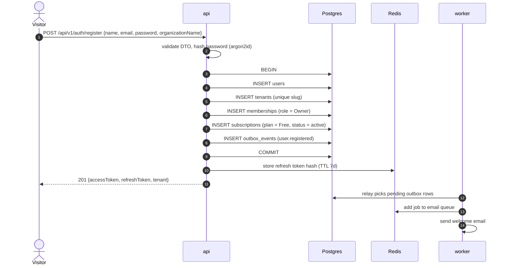

**Failure paths**
- Email already exists → `409 Conflict` (checked before the transaction and enforced by a unique constraint).
- Any insert fails → the transaction rolls back; no orphan tenant, no email sent.

**Lesson — the dual-write problem.** Writing to Postgres and then to Redis are two separate systems. If the process crashes between them, one side is lost. The **outbox** row commits atomically with the business data, so the event can never be lost or sent for data that does not exist. → [ADR-0005](adr/0005-transactional-outbox.md)

---

## Flow 2 — Session lifecycle

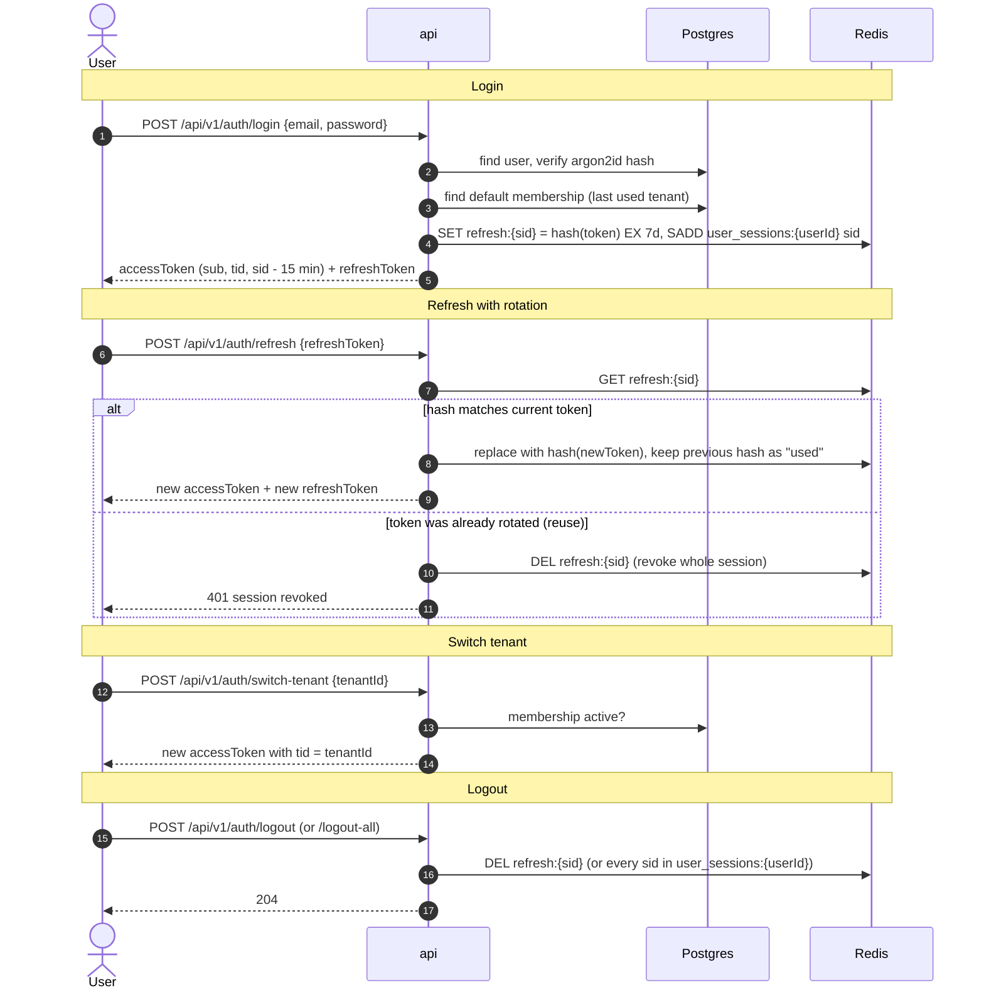

**Lessons**
- Access tokens are **stateless** (verified by signature only) and short-lived; refresh tokens are **stateful** so they can be revoked.
- **Rotation + reuse detection:** if an attacker steals a refresh token and both the attacker and the victim use it, the second use is detected and the session is killed.
- Invalid credentials always return the same generic message — no hint whether the email exists.

---

## Flow 3 — Authenticated request lifecycle

The backbone of the whole system. Example: `POST /api/v1/projects`.

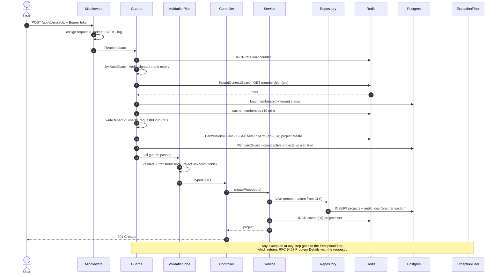

| Step | Failure | Status |
|---|---|---|
| Throttler | too many requests | 429 |
| JWT | missing / invalid / expired token | 401 |
| Tenant context | not a member, membership removed, tenant suspended | 403 |
| Permissions | permission missing or route has no declaration | 403 |
| Plan limit | limit reached | 403 `plan_limit_reached` |
| Validation | invalid body | 400 |
| Service | duplicate name | 409 |

**Lesson — separation of concerns.** Each rule lives in exactly one place in the pipeline. The service contains *only* business logic and is trivially unit-testable.

---

## Flow 4 — Invite and accept a member

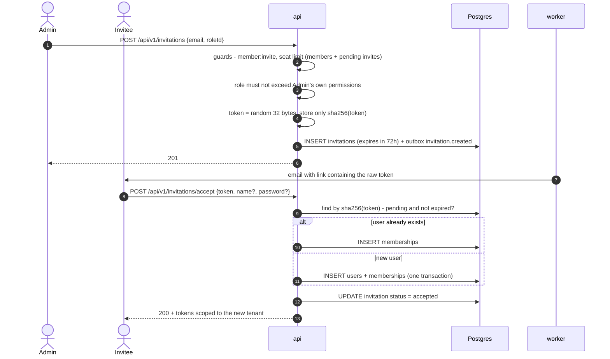

**Lesson.** Secret tokens are stored **hashed**, like passwords. A leaked database dump contains no usable invitation links.

---

## Flow 5 — CRUD with caching

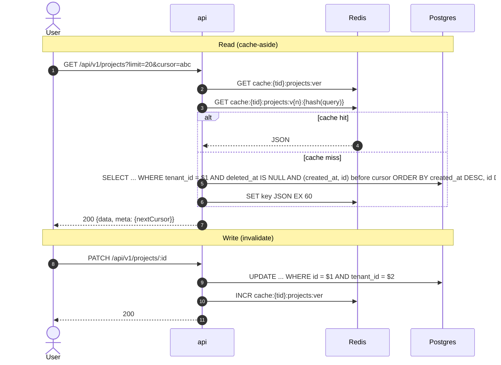

**Lessons**
- **Versioned keys:** one `INCR` invalidates every cached list for the tenant without scanning keys; old entries simply expire.
- **Cursor pagination** stays fast on deep pages and is stable when rows are inserted; fetching `limit + 1` rows tells you whether there is a next page.
- Every query filters by `tenant_id` *and* `deleted_at IS NULL`.

---

## Flow 6 — File upload and download

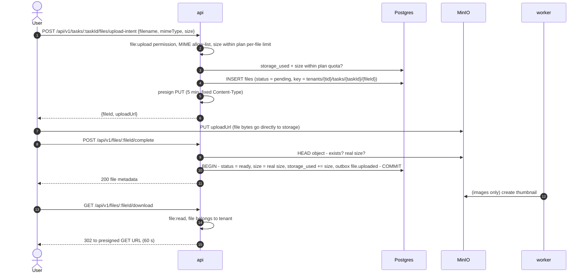

**Failure paths**
- Quota or size exceeded → rejected **before** any upload happens.
- Client never calls `complete` → hourly cleanup deletes the `pending` row and object.
- Real size larger than declared → the file is rejected and the object deleted.

**Lessons.** The API never carries file bytes, so it stays small and fast. Never trust client-declared metadata — verify it against storage.

---

## Flow 7 — Stripe subscription

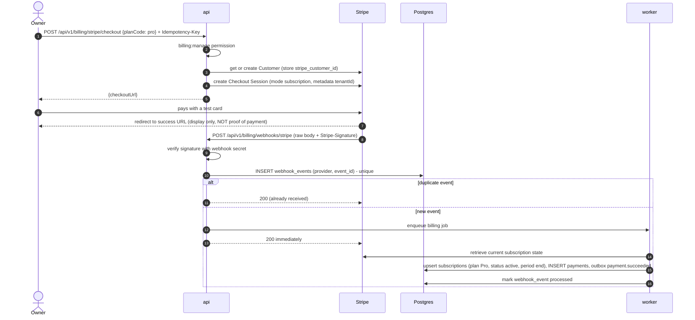

| Stripe event | Effect |
|---|---|
| `checkout.session.completed` | Link Stripe subscription ID to the tenant; plan = Pro, status = active |
| `invoice.paid` | Extend `current_period_end`, record payment, send receipt |
| `invoice.payment_failed` | status = `past_due`, email the Owner |
| `customer.subscription.updated` | Sync status, `cancel_at_period_end`, period dates |
| `customer.subscription.deleted` | Back to Free plan (downgrade rule applies) |

**Lessons**
- The webhook is the **source of truth**; the redirect can be faked or never happen.
- Webhooks arrive **more than once** and **out of order** → idempotency table + fetch-current-state-and-upsert, instead of trusting event order.
- Respond fast (< 1 s) and process asynchronously, or the provider retries and creates duplicates.
- Signature verification needs the **raw request body**, so body parsing must be disabled for this route.

Local testing: `stripe listen --forward-to localhost:3000/api/v1/billing/webhooks/stripe` and `stripe trigger invoice.payment_failed`.

---

## Flow 8 — SSLCommerz payment and renewal

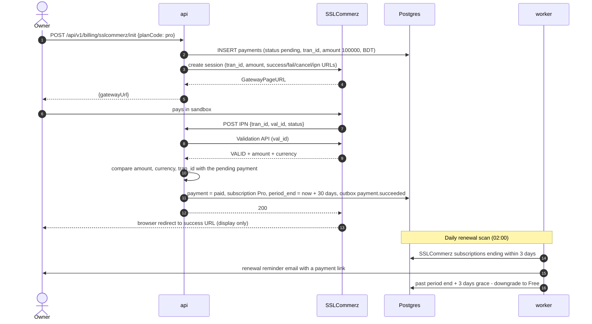

**Lesson.** A gateway without native recurring billing means **you** own the billing cycle: period tracking, reminders, grace period and downgrade — all driven by scheduled jobs. Never trust the IPN body alone; always confirm with the validation API and compare amounts.

---

## Flow 9 — Background job lifecycle

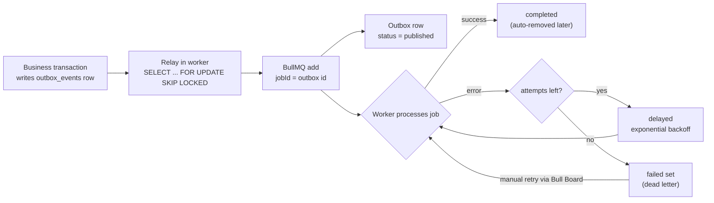

| Guarantee | How |
|---|---|
| Event never lost | Stored in Postgres first (outbox) |
| Event never published twice by concurrent relays | `FOR UPDATE SKIP LOCKED` |
| Job never enqueued twice | BullMQ job ID = outbox ID |
| Side effect safe if the job runs twice | Idempotent consumers (e.g. check `sent_at`, unique constraints) |
| Transient errors recover | Retries with exponential backoff |
| Permanent errors are visible | Failed set + logs + Bull Board |

**Lesson.** Distributed systems give you **at-least-once** delivery. "Exactly once" is achieved by making the *effect* idempotent.

---

## Flow 10 — Password reset

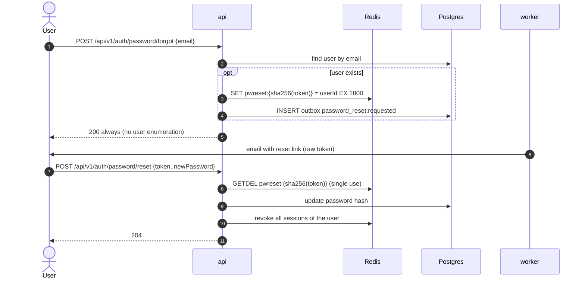

**Lessons.** Same response whether or not the email exists; rate-limit per IP and per email; `GETDEL` makes the token single-use atomically.

---

## Flow 11 — Role change and cache invalidation

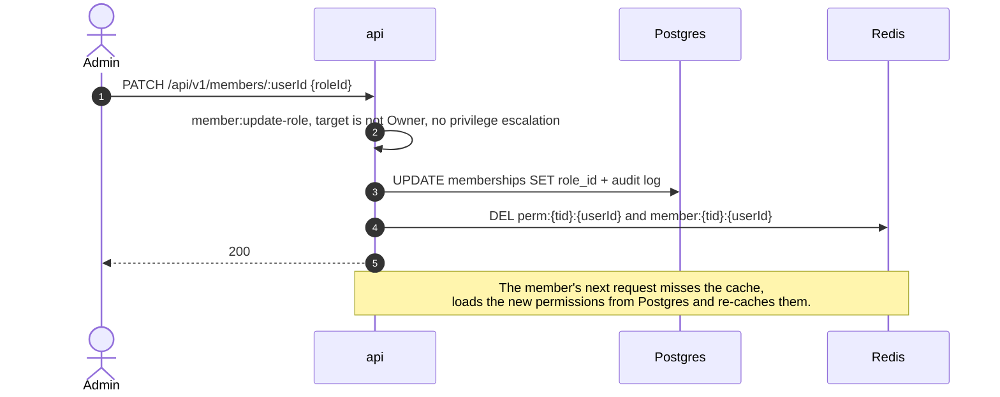

**Lesson.** Caches need an **explicit invalidation path** for security-relevant data. The TTL is only a safety net, not the mechanism.
