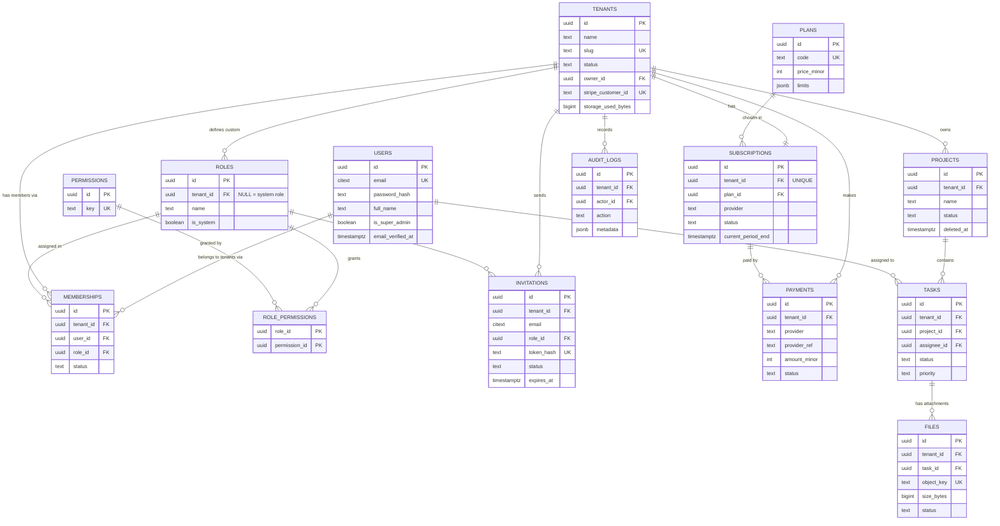

# Data Model — TaskHub

| Field | Value |
|---|---|
| Database | PostgreSQL 18 |
| Status | Draft v1.0 |
| Last updated | 2026-09-28 |
| Related | [Architecture §7, §9](02-architecture.md) · [ADR-0002](adr/0002-multi-tenancy-shared-schema.md) · [ADR-0004](adr/0004-typeorm-explicit-migrations.md) |

---

## 1. Conventions

| Topic | Rule |
|---|---|
| Naming | `snake_case`, **plural** table names, singular column names; FKs named `<entity>_id` |
| Primary keys | `id uuid PRIMARY KEY DEFAULT uuidv7()` (native in Postgres 18) |
| Timestamps | `created_at`, `updated_at` as `timestamptz NOT NULL DEFAULT now()`; always UTC |
| Soft delete | `deleted_at timestamptz NULL` on user-facing business tables; partial indexes use `WHERE deleted_at IS NULL` |
| Tenant scoping | Every tenant-owned table has `tenant_id uuid NOT NULL REFERENCES tenants(id)` |
| Indexes | Tenant-scoped indexes **start with `tenant_id`**; every FK column is indexed |
| Uniqueness | Business uniqueness is **per tenant** (e.g. project name), usually case-insensitive and excluding soft-deleted rows |
| Enumerations | `text` + `CHECK (col IN (...))` — easier to evolve through migrations than Postgres `ENUM` types |
| Money | `integer` minor units (`amount_minor`: cents / paisa) + `currency char(3)`. Never floating point |
| Emails | `citext` (case-insensitive text) — requires the `citext` extension |
| Flexible data | `jsonb` only where the shape genuinely varies (plan limits, audit metadata, webhook payloads) |
| Constraint names | Explicit and predictable: `pk_`, `fk_`, `uq_`, `ix_`, `ck_` prefixes, so errors are readable and migrations are stable |

Required extensions: `citext`, `pg_trgm` (trigram index for name search).

## 2. Entity-relationship diagram

Stand-alone tables (not shown): `webhook_events`, `outbox_events`, `migrations` (managed by TypeORM).

## 3. Table definitions

Legend: **PK** primary key · **FK** foreign key · **UQ** unique · **NN** not null.

### 3.1 Identity & tenancy

#### `users` — global (not tenant-scoped)
| Column | Type | Constraints / default | Notes |
|---|---|---|---|
| id | uuid | PK, `uuidv7()` | |
| email | citext | NN, UQ | case-insensitive |
| password_hash | text | NN | argon2id encoded hash |
| full_name | text | NN, `CHECK (length(full_name) BETWEEN 1 AND 100)` | |
| is_super_admin | boolean | NN, default `false` | platform-level flag |
| email_verified_at | timestamptz | NULL | |
| last_login_at | timestamptz | NULL | |
| created_at / updated_at | timestamptz | NN, `now()` | |
| deleted_at | timestamptz | NULL | |

#### `tenants` — global
| Column | Type | Constraints / default | Notes |
|---|---|---|---|
| id | uuid | PK | |
| name | text | NN | |
| slug | text | NN, UQ, `CHECK (slug ~ '^[a-z0-9-]{3,50}$')` | URL-safe identifier |
| status | text | NN, default `'active'`, `CHECK IN ('active','suspended')` | suspended → all tenant requests 403 |
| owner_id | uuid | NN, FK → users | exactly one owner |
| stripe_customer_id | text | NULL, UQ | created on first checkout |
| storage_used_bytes | bigint | NN, default 0, `CHECK (>= 0)` | denormalized counter for fast quota checks |
| created_at / updated_at / deleted_at | timestamptz | | |

#### `memberships` — tenant-scoped
| Column | Type | Constraints / default | Notes |
|---|---|---|---|
| id | uuid | PK | |
| tenant_id | uuid | NN, FK → tenants | |
| user_id | uuid | NN, FK → users | |
| role_id | uuid | NN, FK → roles | |
| status | text | NN, default `'active'`, `CHECK IN ('active','suspended')` | |
| last_active_at | timestamptz | NULL | used to pick the default tenant at login |
| created_at / updated_at | timestamptz | | |

Constraints & indexes: `uq_memberships_tenant_user (tenant_id, user_id)` · `ix_memberships_user (user_id)` (list "my organizations").

### 3.2 Access control

#### `permissions` — global, seeded
| Column | Type | Constraints | Notes |
|---|---|---|---|
| id | uuid | PK | |
| key | text | NN, UQ, `CHECK (key ~ '^[a-z-]+:[a-z-]+$')` | e.g. `project:create` |
| group_name | text | NN | e.g. `Projects` |
| description | text | NN | |

#### `roles` — system (global) or custom (tenant-scoped)
| Column | Type | Constraints | Notes |
|---|---|---|---|
| id | uuid | PK | |
| tenant_id | uuid | NULL, FK → tenants | `NULL` = system role (Owner, Admin, Member, Viewer) |
| name | text | NN | |
| description | text | NULL | |
| is_system | boolean | NN, default `false` | system roles cannot be edited or deleted |
| created_at / updated_at | timestamptz | | |

Constraint: `uq_roles_tenant_name UNIQUE NULLS NOT DISTINCT (tenant_id, name)`.
> **Learning point:** in a normal unique constraint, `NULL` values are considered *distinct*, so two system roles named "Admin" with `tenant_id NULL` would be allowed. `NULLS NOT DISTINCT` (Postgres 15+) fixes this.

#### `role_permissions` — join table
| Column | Type | Constraints |
|---|---|---|
| role_id | uuid | PK (part), FK → roles `ON DELETE CASCADE` |
| permission_id | uuid | PK (part), FK → permissions `ON DELETE CASCADE` |

#### `invitations` — tenant-scoped
| Column | Type | Constraints / default | Notes |
|---|---|---|---|
| id | uuid | PK | |
| tenant_id | uuid | NN, FK → tenants | |
| email | citext | NN | |
| role_id | uuid | NN, FK → roles | |
| token_hash | text | NN, UQ | SHA-256 of the raw token |
| status | text | NN, default `'pending'`, `CHECK IN ('pending','accepted','revoked','expired')` | |
| invited_by | uuid | NN, FK → users | |
| expires_at | timestamptz | NN | now + 72 h |
| accepted_at | timestamptz | NULL | |
| created_at / updated_at | timestamptz | | |

Index: `uq_invitations_pending_email UNIQUE (tenant_id, email) WHERE status = 'pending'` — a **partial unique index**: only one *pending* invite per email per tenant, while history is kept.

### 3.3 Billing

#### `plans` — global, seeded
| Column | Type | Constraints / default | Notes |
|---|---|---|---|
| id | uuid | PK | |
| code | text | NN, UQ | `free`, `pro` |
| name | text | NN | |
| price_minor_usd | integer | NN, `CHECK (>= 0)` | 900 = $9.00 |
| price_minor_bdt | integer | NN, `CHECK (>= 0)` | 100000 = ৳1,000.00 |
| billing_interval | text | NN, default `'month'` | |
| limits | jsonb | NN | `{"projects":3,"members":3,"storageBytes":104857600,"maxFileBytes":10485760,"auditDays":7}` |
| stripe_price_id | text | NULL | Stripe Price for this plan |
| is_active | boolean | NN, default `true` | |
| sort_order | integer | NN, default 0 | |

#### `subscriptions` — tenant-scoped, **one current row per tenant**
| Column | Type | Constraints / default | Notes |
|---|---|---|---|
| id | uuid | PK | |
| tenant_id | uuid | NN, FK → tenants, **UQ** | one subscription per tenant |
| plan_id | uuid | NN, FK → plans | |
| provider | text | NN, `CHECK IN ('none','stripe','sslcommerz')` | `none` for Free |
| provider_subscription_id | text | NULL | Stripe `sub_...` |
| status | text | NN, `CHECK IN ('active','past_due','grace','canceled')` | see state machine in Architecture §13 |
| current_period_start | timestamptz | NULL | |
| current_period_end | timestamptz | NULL | |
| cancel_at_period_end | boolean | NN, default `false` | |
| created_at / updated_at | timestamptz | | |

Index: `ix_subscriptions_renewal (provider, status, current_period_end)` — used by the daily renewal scan.

#### `payments` — tenant-scoped, append-mostly
| Column | Type | Constraints / default | Notes |
|---|---|---|---|
| id | uuid | PK | |
| tenant_id | uuid | NN, FK → tenants | |
| subscription_id | uuid | NN, FK → subscriptions | |
| plan_id | uuid | NN, FK → plans | plan paid for |
| provider | text | NN, `CHECK IN ('stripe','sslcommerz')` | |
| provider_ref | text | NN | Stripe invoice ID or SSLCommerz `tran_id` |
| amount_minor | integer | NN, `CHECK (> 0)` | |
| currency | char(3) | NN | `USD`, `BDT` |
| status | text | NN, `CHECK IN ('pending','paid','failed','refunded')` | |
| paid_at | timestamptz | NULL | |
| raw_response | jsonb | NULL | validation response, for debugging |
| created_at / updated_at | timestamptz | | |

Constraints & indexes: `uq_payments_provider_ref (provider, provider_ref)` · `ix_payments_tenant_created (tenant_id, created_at DESC)`.

#### `webhook_events` — global, idempotency log
| Column | Type | Constraints / default | Notes |
|---|---|---|---|
| id | uuid | PK | |
| provider | text | NN | |
| event_id | text | NN | Stripe `evt_...` / SSLCommerz `val_id` |
| event_type | text | NN | |
| payload | jsonb | NN | full raw event |
| status | text | NN, default `'received'`, `CHECK IN ('received','processed','failed')` | |
| error | text | NULL | |
| received_at | timestamptz | NN, `now()` | |
| processed_at | timestamptz | NULL | |

Constraint: `uq_webhook_events_provider_event (provider, event_id)` — **the idempotency guarantee**.

### 3.4 Business data

#### `projects` — tenant-scoped
| Column | Type | Constraints / default | Notes |
|---|---|---|---|
| id | uuid | PK | |
| tenant_id | uuid | NN, FK → tenants | |
| name | text | NN, `CHECK (length(name) BETWEEN 1 AND 120)` | |
| description | text | NULL | |
| status | text | NN, default `'active'`, `CHECK IN ('active','archived')` | archived projects don't count toward the limit |
| created_by | uuid | NN, FK → users | |
| created_at / updated_at / deleted_at | timestamptz | | |

Indexes:
- `uq_projects_tenant_name UNIQUE (tenant_id, lower(name)) WHERE deleted_at IS NULL` — case-insensitive, and a deleted project's name can be reused.
- `ix_projects_tenant_created (tenant_id, created_at DESC, id DESC) WHERE deleted_at IS NULL` — list + cursor pagination.
- `ix_projects_name_trgm USING gin (name gin_trgm_ops)` — `ILIKE '%term%'` search.
- `uq_projects_tenant_id UNIQUE (tenant_id, id)` — target for composite FKs (see tasks).

#### `tasks` — tenant-scoped
| Column | Type | Constraints / default | Notes |
|---|---|---|---|
| id | uuid | PK | |
| tenant_id | uuid | NN, FK → tenants | |
| project_id | uuid | NN | composite FK `(tenant_id, project_id) → projects(tenant_id, id)` |
| title | text | NN, `CHECK (length(title) BETWEEN 1 AND 200)` | |
| description | text | NULL | |
| status | text | NN, default `'todo'`, `CHECK IN ('todo','in_progress','done')` | |
| priority | text | NN, default `'medium'`, `CHECK IN ('low','medium','high')` | |
| assignee_id | uuid | NULL, FK → users | must be a member (checked in the service) |
| due_date | date | NULL | |
| created_by | uuid | NN, FK → users | |
| created_at / updated_at / deleted_at | timestamptz | | |

Indexes: `ix_tasks_project_status (tenant_id, project_id, status) WHERE deleted_at IS NULL` · `ix_tasks_assignee (tenant_id, assignee_id) WHERE deleted_at IS NULL` · `uq_tasks_tenant_id UNIQUE (tenant_id, id)`.

> **Learning point — composite foreign key.** `FOREIGN KEY (tenant_id, project_id) REFERENCES projects (tenant_id, id)` makes it **impossible at the database level** to attach a task to another tenant's project, even if application code has a bug.

#### `files` — tenant-scoped
| Column | Type | Constraints / default | Notes |
|---|---|---|---|
| id | uuid | PK | also used in the object key |
| tenant_id | uuid | NN, FK → tenants | |
| task_id | uuid | NN | composite FK `(tenant_id, task_id) → tasks(tenant_id, id)` |
| object_key | text | NN, UQ | `tenants/{tenantId}/tasks/{taskId}/{fileId}` |
| original_name | text | NN | shown to users, never used as a key |
| mime_type | text | NN | |
| size_bytes | bigint | NN, `CHECK (>= 0)` | declared, then replaced with the real size |
| status | text | NN, default `'pending'`, `CHECK IN ('pending','ready','deleted')` | |
| thumbnail_key | text | NULL | |
| uploaded_by | uuid | NN, FK → users | |
| created_at / updated_at / deleted_at | timestamptz | | |

Indexes: `ix_files_task (tenant_id, task_id) WHERE status = 'ready'` · `ix_files_pending_cleanup (created_at) WHERE status = 'pending'`.

### 3.5 Platform

#### `audit_logs` — tenant-scoped, **append-only**
| Column | Type | Constraints | Notes |
|---|---|---|---|
| id | uuid | PK | |
| tenant_id | uuid | NULL, FK → tenants | NULL for platform-level actions |
| actor_id | uuid | NULL, FK → users | NULL for system actions |
| action | text | NN | e.g. `project.created`, `member.role_changed` |
| entity_type | text | NN | |
| entity_id | uuid | NULL | |
| metadata | jsonb | NN, default `'{}'` | before/after values |
| request_id | text | NULL | correlation with logs |
| ip_address | inet | NULL | |
| user_agent | text | NULL | |
| created_at | timestamptz | NN | no `updated_at`: rows are never updated |

Index: `ix_audit_tenant_created (tenant_id, created_at DESC)`. The app's DB role gets `INSERT, SELECT` only on this table — updates and deletes are impossible (learning point: **GRANT-level** immutability).

#### `outbox_events` — global
| Column | Type | Constraints / default | Notes |
|---|---|---|---|
| id | uuid | PK | becomes the BullMQ job ID |
| tenant_id | uuid | NULL | |
| event_type | text | NN | e.g. `user.registered` |
| payload | jsonb | NN | includes `requestId` |
| status | text | NN, default `'pending'`, `CHECK IN ('pending','published','failed')` | |
| attempts | integer | NN, default 0 | |
| available_at | timestamptz | NN, `now()` | retry scheduling for the relay |
| published_at | timestamptz | NULL | |
| last_error | text | NULL | |
| created_at | timestamptz | NN | |

Index: `ix_outbox_pending (available_at) WHERE status = 'pending'` — tiny partial index the relay polls. Published rows older than 7 days are purged by a scheduled job.

### 3.6 What is **not** in Postgres

| Data | Stored in | Why |
|---|---|---|
| Refresh-token sessions | Redis (`refresh:*`, `user_sessions:*`) | Short-lived, TTL-based expiry, fast revocation → [ADR-0011](adr/0011-sessions-in-redis.md) |
| Password-reset tokens | Redis (`pwreset:*`) | 30-min lifetime, single use via `GETDEL` |
| Permission & membership cache | Redis | Derived data; Postgres is the source of truth |
| File contents | MinIO | Databases are not blob stores |

## 4. Row-Level Security (stretch goal)

A second isolation wall inside the database:

1. Enable RLS on every tenant-scoped table and `FORCE` it for the app role.
2. Policy: rows visible only when `tenant_id = current_setting('app.tenant_id')::uuid`.
3. At the start of each request transaction, the app runs `SET LOCAL app.tenant_id = '<tid>'`.
4. A forgotten `WHERE tenant_id` in code now returns **zero rows** instead of leaking data.

Trade-off: every query must run inside a transaction that sets the variable, and connection pooling must be handled carefully (`SET LOCAL` is transaction-scoped for exactly this reason).

## 5. Migration strategy

| Rule | Detail |
|---|---|
| Tool | TypeORM CLI with a dedicated `data-source.ts`; `synchronize` is **always false** |
| Naming | `<timestamp>-<VerbObject>` e.g. `1759000000000-CreateProjectsTable` |
| Granularity | One logical change per migration; small and reviewable |
| Review | Always **read the generated SQL** before committing; hand-write migrations for indexes, extensions, RLS, grants |
| Reversibility | Every migration has a working `down()` in development |
| Immutability | Never edit a migration that has run anywhere shared; write a new one instead |
| Zero-downtime mindset | Add column nullable → backfill → add `NOT NULL`; create indexes `CONCURRENTLY` (outside a transaction) on large tables |
| Execution | Dev: API container entrypoint runs pending migrations. Prod (conceptual): a one-off job before deploying new code |
| Tracking | The `migrations` table records applied migrations — inspect it with psql |

Planned initial migrations (in order):
1. `EnableExtensions` — `citext`, `pg_trgm`
2. `CreateIdentityTables` — `users`, `tenants`
3. `CreateAccessControlTables` — `permissions`, `roles`, `role_permissions`, `memberships`, `invitations`
4. `CreateBillingTables` — `plans`, `subscriptions`, `payments`, `webhook_events`
5. `CreateBusinessTables` — `projects`, `tasks`, `files`
6. `CreatePlatformTables` — `audit_logs`, `outbox_events`
7. `CreateAppRoleAndGrants` — least-privilege role, append-only audit grants

## 6. Seed data

Seeds are **idempotent** (upsert by natural key: `permissions.key`, `roles(tenant_id, name)`, `plans.code`, `users.email`) and safe to run on every start.

| Order | Seed | Content |
|---|---|---|
| 1 | Permissions | The 23 permissions from [PRD §7.1](01-PRD.md#71-permission-catalog) |
| 2 | System roles | Owner, Admin, Member, Viewer (`tenant_id NULL`, `is_system true`) |
| 3 | Role permissions | Matrix from [PRD §7.2](01-PRD.md#72-system-roles-seeded-not-editable) |
| 4 | Plans | Free and Pro with limits from [PRD §6](01-PRD.md#6-plans-limits--pricing); `stripe_price_id` from env |
| 5 | Super admin | User from `SEED_SUPERADMIN_EMAIL` / `SEED_SUPERADMIN_PASSWORD`, `is_super_admin = true` |
| 6 | Demo data (dev only) | Tenant "Acme Inc" with an owner, one member, 2 projects and a few tasks — skipped when `NODE_ENV=production` |

## 7. Useful psql commands

| Goal | Command |
|---|---|
| Connect | `docker compose exec postgres psql -U <user> -d <db>` |
| List tables / describe one | `\dt` · `\d+ projects` |
| List indexes of a table | `\di+ *projects*` |
| Applied migrations | `SELECT * FROM migrations ORDER BY id;` |
| Query plan | `EXPLAIN (ANALYZE, BUFFERS) SELECT ...;` |
| Table sizes | `\dt+` |
| Current connections | `SELECT pid, usename, state, query FROM pg_stat_activity;` |
| Check RLS policies | `\d+ projects` (policies listed at the bottom) |
